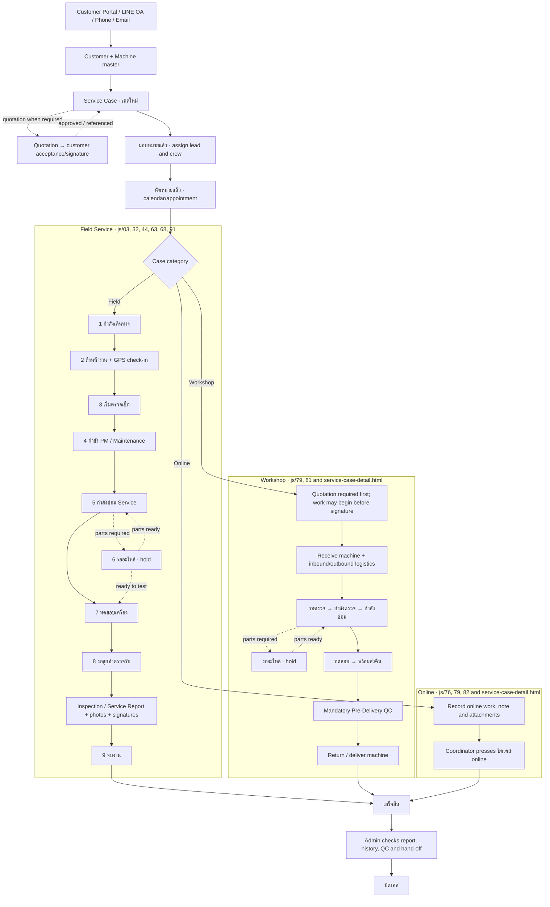
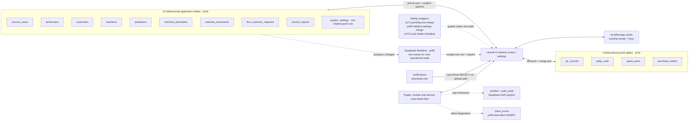

# I-MODE Plus Service & Maintenance architecture

Current as of 2026-09-21. The application is a static, classic-script web application.
`index.html` is markup; `js/03-app-core.js` defines the original application and later
numbered files wrap or replace its globals in load order. The number in each filename is
therefore part of the runtime architecture, not cosmetic organisation.

Top-level `let` / `const` bindings such as `cases`, `settings`, `currentUser` and `supa` are
shared lexical globals but are not properties of `window`. Patch files must access those by
bare identifier. Top-level function declarations are window properties and form the override
chains below.

## 1. Active override chains

An arrow means “the later file captures the version on its left and installs an outer
wrapper”. The rightmost node in a chain is the active exported function. A replacement is
labelled explicitly because it does not call the earlier implementation.

```mermaid
flowchart TB
  subgraph NAV["Navigation · window.goPage"]
    G03["03 app-core"] --> G09["09 UAT accounts"] --> G10["10 role home"] --> G12["12 role scope"]
    G12 --> G14["14 customer entry"] --> G16["16 work assign"] --> G19["19 customer home"]
    G19 --> G22["22 history"] --> G25["25 beta"] --> G32["32 field workspace"]
    G32 --> G40["40 trash"] --> G43["43 quote view"] --> G44["44 tech flow"]
    G44 --> G45["45 done jobs"] --> G49["49 requests"] --> G60["60 drill and bars"]
    G60 --> G61["61 request log"] --> G73A["73 field scope A"] --> G73B["73 field scope B"]
    G73B --> G74["74 new-job badge"] --> G75["75 quote approval"] --> G83["83 quote accept"]
    G83 --> G87["87 topbar scroll"] --> G89["89 purchasing · active"]
  end

  subgraph SYNC["Cloud pull · window.syncCloud"]
    S03["03 app-core"] --> S23["23 cloud config"] --> S29["29 modal history"] --> S38["38 team assignment"]
    S38 --> S41["41 operational tables"] --> S43["43 quote view"] --> S45["45 done jobs"]
    S45 --> S47["47 role presets"] --> S48["48 case response"] --> S49["49 requests"]
    S49 --> S65["65 individual permissions"] --> S69["69 status log"] --> S71["71 merge unsynced"]
    S71 --> S72["72 storage guard"] --> S76["76 case form"] --> S83["83 quote accept"]
    S83 --> S90["90 settings merge · active"]
  end

  subgraph WRITE["Important write chains"]
    L03["03 saveLocal"] -. "replaced" .-> L04["04 saveLocal"] --> L41["41 ops diff push"]
    L41 --> L69["69 case-status audit"] --> L72["72 quota guard · active"]

    C03["03 cloudUpsertCase"] --> C38["38 crew in assignee"] --> C42["42 customer media"]
    C42 --> C48["48 responded stamp · active"]

    F03["03 saveFieldStatus"] --> F63["63 finish confirmation"] --> F68["68 signature gate"]
    F68 --> F78["78 app confirmation dialog · active"]

    SS03["03 cloudSaveSettings"] --> SS90["90 merge additive maps · active"]
  end

  subgraph RENDER["Case and detail rendering"]
    RC03["03 renderCases"] --> RC26["26 case flow"] --> RC92["92 updated-first · active"]
    P03["03 paginateList"] --> P92["92 updated-first before slice · active"]
    D03["03 openCaseDetail"] --> D42["42 media"] --> D48["48 response"]
    D48 --> D52["52 record actions"] --> D88["88 case popup · active"]
  end

  subgraph BOOT["Cloud boot and diagnostics"]
    I03["03 initCloud"] --> I85["85 Realtime"] --> I93["93 client-error flush · active"]
  end
```

The diagram covers the high-risk chains rather than every exported helper. `renderAll()` has
the same shape: `js/04` replaces the core renderer, then `js/06`, `26`, `49`, `61`, `73`,
`74`, `75`, `76`, `80`, `83` and `89` wrap it. A call made through a closure can bypass a
later `window.*` wrapper, so each change still has to trace the actual caller.

Sources: [`js/03-app-core.js`](../js/03-app-core.js),
[`js/04-v67EnhanceScript.js`](../js/04-v67EnhanceScript.js),
[`js/41-v70OpsSyncScript.js`](../js/41-v70OpsSyncScript.js),
[`js/63-v70FieldSheetScript.js`](../js/63-v70FieldSheetScript.js),
[`js/68-v70CloseSignatureGateScript.js`](../js/68-v70CloseSignatureGateScript.js),
[`js/71-v70SyncMergeScript.js`](../js/71-v70SyncMergeScript.js),
[`js/72-v70StorageGuardScript.js`](../js/72-v70StorageGuardScript.js),
[`js/85-v70RealtimeScript.js`](../js/85-v70RealtimeScript.js),
[`js/90-v70SettingsMergeScript.js`](../js/90-v70SettingsMergeScript.js),
[`js/92-v70CaseUpdatedScript.js`](../js/92-v70CaseUpdatedScript.js), and
[`js/93-v70ClientErrorScript.js`](../js/93-v70ClientErrorScript.js).

## 2. Business flow

The case is the centre of the workflow. `รออะไหล่` is a conditional hold, not a required
stage. Workshop and Online are categories with different execution tracks; they do not use
the onsite GPS/field ladder.

Field corrections replace the selected `fieldStatusLog` entry, retain up to five revisions,
stamp `editedAt` / `editedBy`, and move through Supabase Realtime without changing the log
length. The standalone case page infers passed main steps when an old case has a partial log,
but never infers the optional `รออะไหล่` branch.

Sources: [`js/03-app-core.js`](../js/03-app-core.js),
[`js/32-v70FieldWorkspaceScript.js`](../js/32-v70FieldWorkspaceScript.js),
[`js/63-v70FieldSheetScript.js`](../js/63-v70FieldSheetScript.js),
[`js/68-v70CloseSignatureGateScript.js`](../js/68-v70CloseSignatureGateScript.js),
[`js/79-v70IssueCaseTypeScript.js`](../js/79-v70IssueCaseTypeScript.js),
[`js/81-v70WorkshopScript.js`](../js/81-v70WorkshopScript.js),
[`js/82-v70CaseCategoryScript.js`](../js/82-v70CaseCategoryScript.js),
[`js/91-v70FieldStepEditScript.js`](../js/91-v70FieldStepEditScript.js), and
[`service-case-detail.html`](../service-case-detail.html).

## 3. Browser and Supabase data flow

The “15 tables” below are the application data plane. `profiles`, `auth_audit` and the new
optional `client_errors` inbox are support tables and are intentionally outside that count.

`system_settings` deserves special attention: the application stores all configuration and
several cross-device operational maps in one row (`id = main`) and `cloudSaveSettings()`
rewrites the whole JSON document. `js/90` preserves IDs for known additive maps before a
write/sync, but this is still a shared last-writer-sensitive blob, not field-level storage.

`notifications` is the one application table that is downloaded but has no cloud upload
function. Several visible alerts are derived locally from cases instead. The four operational
tables store each complete record in a `data jsonb` column so new JavaScript fields are not
silently dropped by a column whitelist.

Sources: [`js/03-app-core.js`](../js/03-app-core.js),
[`js/41-v70OpsSyncScript.js`](../js/41-v70OpsSyncScript.js),
[`js/71-v70SyncMergeScript.js`](../js/71-v70SyncMergeScript.js),
[`js/72-v70StorageGuardScript.js`](../js/72-v70StorageGuardScript.js),
[`js/85-v70RealtimeScript.js`](../js/85-v70RealtimeScript.js),
[`js/90-v70SettingsMergeScript.js`](../js/90-v70SettingsMergeScript.js),
[`supabase/00-tables.sql`](../supabase/00-tables.sql), and
[`supabase/05-v70-operational-tables.sql`](../supabase/05-v70-operational-tables.sql).
